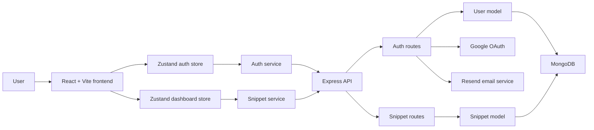
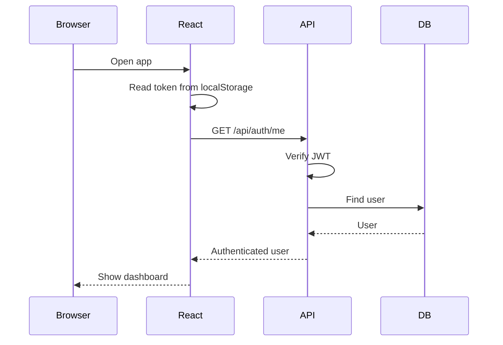
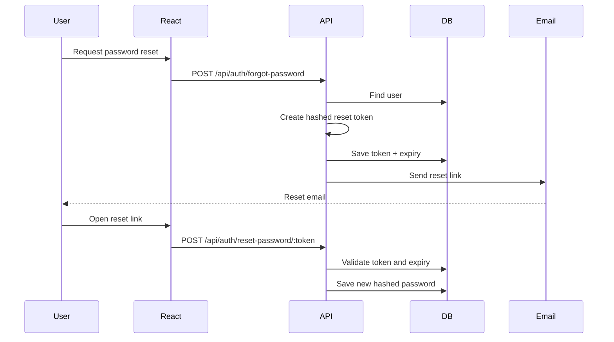

# CodeVault

CodeVault is a full-stack code snippet manager for saving, organizing, editing, and reusing reusable pieces of code. The project combines a React dashboard with a protected Express API, MongoDB persistence, JWT authentication, Google OAuth, email workflows, and a clean dark-first interface.

## Main Ideas

- Keep code snippets tied to the authenticated user.
- Make snippet creation fast: choose a title and language, write code, then save.
- Support both email/password auth and Google sign-in.
- Use protected API routes so users can only access their own snippets.
- Keep frontend state predictable with Zustand instead of heavy prop drilling.
- Build a dashboard that feels practical: stats, filters, editor, favorites, and dark/light themes.
- Add real account workflows such as welcome emails and password reset.

## Features

### Authentication

- Email/password signup and login
- JWT-based authentication
- Session restoration on app startup with `/api/auth/me`
- Logout flow
- Google OAuth login
- Welcome email on signup
- Password reset email flow with expiring reset tokens

### Dashboard

- Create snippets with a title and language
- Organize snippets into collections
- Support built-in languages plus a custom `Other` option
- Add multiple tags to a snippet
- Edit snippet title, description, and code
- Save snippets to MongoDB
- Delete snippets
- Favorite/unfavorite snippets
- Search snippets
- Filter snippets by language
- Dashboard stats for total snippets, favorites, and languages
- Responsive layout
- Light and dark mode, with dark mode as the default

## Tech Stack

### Frontend

- React 19
- Vite 8
- Tailwind CSS 4
- Zustand
- Framer Motion
- Lucide React

### Backend

- Node.js
- Express 5
- MongoDB Atlas
- Mongoose
- JSON Web Token
- bcryptjs
- Passport.js
- Google OAuth 2.0
- Resend

## System Design



## Authentication Flow



## Password Reset Flow



## Data Models

### User

```js
{
  fullName: String,
  email: String,
  password: String,
  googleId: String,
  profilePic: String,
  resetPasswordToken: String,
  resetPasswordExpiresAt: Date
}
```

### Snippet

```js
{
  user: ObjectId,
  title: String,
  description: String,
  language: String,
  tags: [String],
  collection: ObjectId,
  favorite: Boolean,
  code: String
}
```

### Collection

```js
{
  user: ObjectId,
  name: String,
  description: String
}
```

## API Endpoints

### Auth

| Method | Endpoint | Purpose |
| --- | --- | --- |
| `POST` | `/api/auth/signup` | Create account |
| `POST` | `/api/auth/login` | Log in |
| `POST` | `/api/auth/logout` | Log out |
| `GET` | `/api/auth/me` | Get current authenticated user |
| `GET` | `/api/auth/google` | Start Google OAuth |
| `GET` | `/api/auth/google/callback` | Finish Google OAuth |
| `POST` | `/api/auth/forgot-password` | Request password reset email |
| `POST` | `/api/auth/reset-password/:token` | Save new password |

### Snippets

| Method | Endpoint | Purpose |
| --- | --- | --- |
| `GET` | `/api/snippets` | Get current user's snippets |
| `POST` | `/api/snippets` | Create snippet |
| `GET` | `/api/snippets/:id` | Get one snippet |
| `PUT` | `/api/snippets/:id` | Update snippet |
| `DELETE` | `/api/snippets/:id` | Delete snippet |
| `PATCH` | `/api/snippets/:id/favorite` | Toggle favorite |

### Collections

| Method | Endpoint | Purpose |
| --- | --- | --- |
| `GET` | `/api/collections` | Get current user's collections |
| `POST` | `/api/collections` | Create collection |
| `PUT` | `/api/collections/:id` | Update collection |
| `DELETE` | `/api/collections/:id` | Delete collection |

## Project Structure

```txt
codevault/
|-- src/
|   |-- components/
|   |   |-- filters/
|   |   |-- layout/
|   |   |-- snippets/
|   |   `-- ui/
|   |-- features/
|   |   `-- dashboard/
|   |       |-- components/
|   |       |-- stores/
|   |       `-- utils/
|   |-- pages/
|   |   `-- auth/
|   |-- services/
|   |-- stores/
|   `-- data/
|-- backend/
|   |-- config/
|   |-- controllers/
|   |-- middleware/
|   |-- models/
|   |-- routes/
|   |-- utils/
|   `-- server.js
|-- package.json
`-- vercel.json
```

## Environment Variables

Create `backend/.env`:

```env
PORT=5000
MONGO_URI=your_mongodb_connection_string
JWT_SECRET=your_jwt_secret
JWT_EXPIRES_IN=7d
NODE_ENV=development
CLIENT_URL=http://localhost:5173

GOOGLE_CLIENT_ID=your_google_client_id
GOOGLE_CLIENT_SECRET=your_google_client_secret
GOOGLE_CALLBACK_URL=http://localhost:5000/api/auth/google/callback

RESEND_API_KEY=your_resend_api_key
SEND_EMAILS=true
EMAIL_FROM=onboarding@resend.dev
EMAIL_FROM_NAME=CodeVault
```

Create a frontend `.env` only if you need a custom API base URL:

```env
VITE_API_URL=http://localhost:5000/api
```

## Local Setup

### 1. Install frontend dependencies

```bash
npm install
```

### 2. Install backend dependencies

```bash
cd backend
npm install
```

### 3. Start the backend

```bash
npm run dev
```

### 4. Start the frontend

From the project root:

```bash
npm run dev
```

Frontend:

```txt
http://localhost:5173
```

Backend:

```txt
http://localhost:5000
```

## Deployment Notes

- Frontend can be deployed with Vercel using:
  - Framework preset: `Vite`
  - Root directory: `codevault`
  - Build command: `npm run build`
  - Output directory: `dist`
- The Express backend should be deployed separately to a Node-compatible host such as Render or Railway.
- Add production frontend and backend environment variables in the hosting dashboards.
- Update `CLIENT_URL`, Google OAuth callback URL, CORS origin, and API URL for production.

## Security Notes

- Snippet routes are protected with JWT middleware.
- Each snippet query is scoped to the authenticated user's id.
- Collections are scoped to the authenticated user's id.
- Passwords are hashed with bcrypt.
- Reset tokens are hashed before storage and expire after 15 minutes.
- `.env` files and `node_modules` should not be committed.
- Rotate exposed API keys before public deployment.
- `onboarding@resend.dev` is useful for testing, but production email sending requires a verified sender domain.

## Current Learning Concepts Covered

- Component-based frontend architecture
- Feature-based folder structure
- Global state with Zustand
- REST API design
- MongoDB data modeling
- JWT authentication
- OAuth integration
- Protected resources and ownership checks
- Async API handling
- Password hashing
- Transaction-like email workflows
- Responsive UI design
- Deployment configuration

## Possible Next Improvements

- Email verification
- Profile settings
- Tag editing UI
- Language editing after snippet creation
- Pagination for large snippet collections
- Toast notifications
- Automated tests
- Rate limiting and security middleware
- Production logging and monitoring
